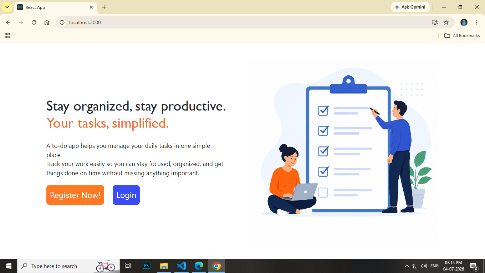
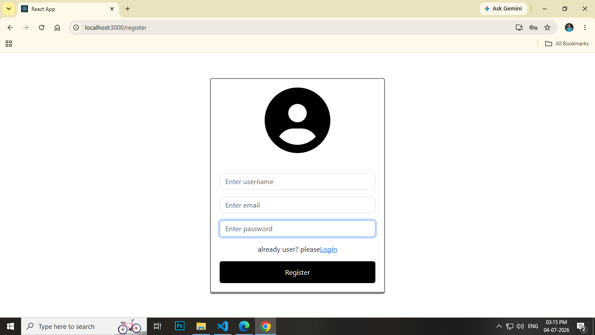
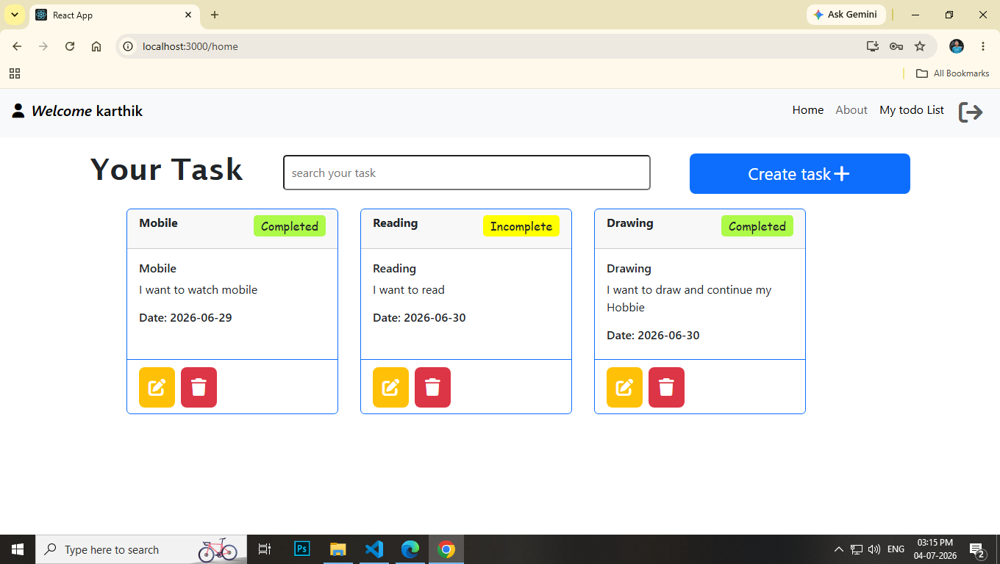
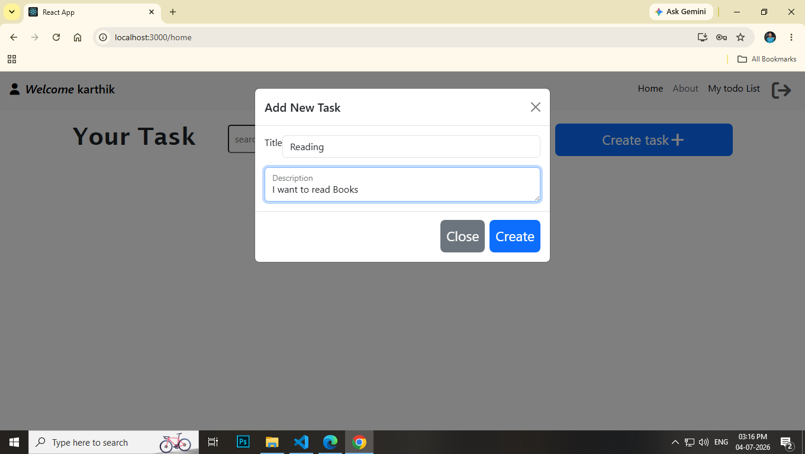
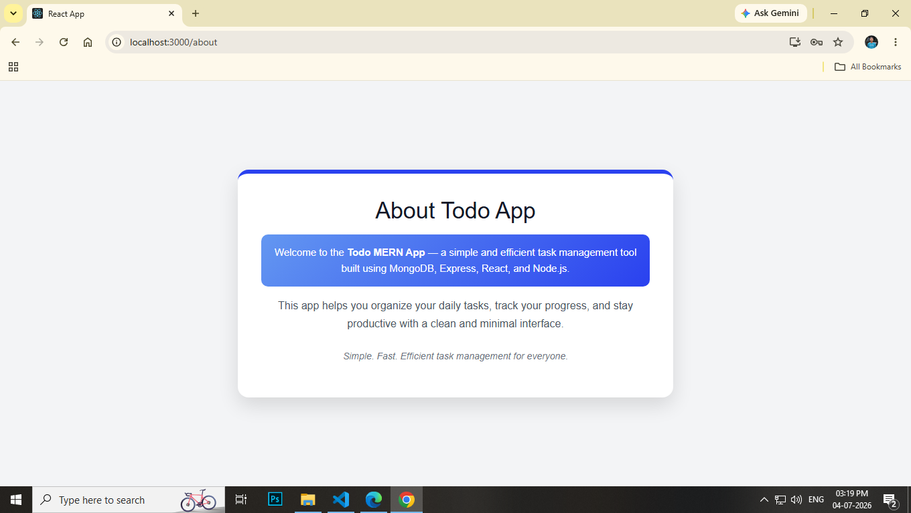
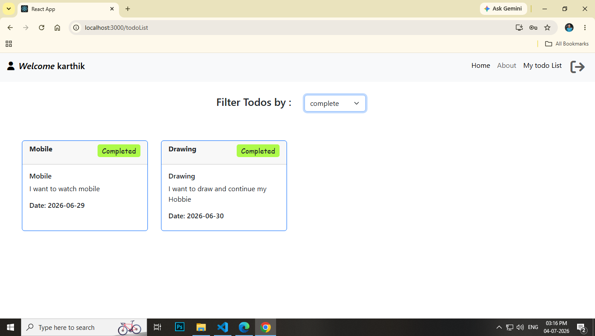

# 📝 MERN Todo App

A full-stack Todo application built using the **MERN Stack (MongoDB, Express, React, Node.js)**.  
This project allows users to register, login, and manage their daily tasks efficiently.

---

## 🚀 Features

- 🔐 User Authentication (Login / Register)
- ➕ Add new tasks
- 📝 Update existing tasks
- ❌ Delete tasks
- ✔️ Mark tasks as completed
- ⚡ Fast and responsive UI

---

## 📸 Screenshots

### Landing Page

### Register Page

### Home Page

### Create New Task

### About Page

### Todo List Page

## 🛠️ Tech Stack

**Frontend:**

- React.js
- React Router DOM
- Bootstrap
- React Hot Toast

**Backend:**

- Node.js
- Express.js
- MongoDB
- Mongoose
- JWT Authentication
